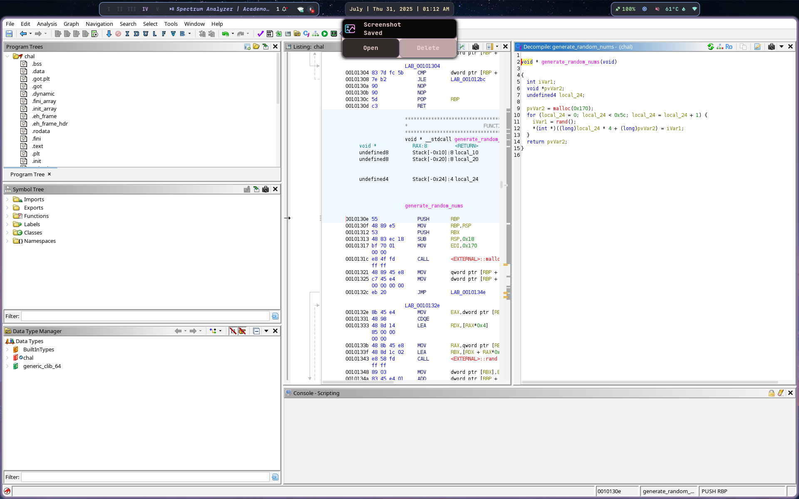

# CTF Write-up: Reverse Engineering `chal` Binary

**Author POV:** In this write-up, I'll walk you through how I tackled the reverse-engineering challenge, from unpacking the binary to extracting the final flag.

---

## 1. Overview

- **Challenge file:** `chal`
- **Task type:** Reverse engineering (Packed with UPX)
- **Goal:** Recover the secret flag that the binary verifies.
- **Tools used:** `strings`, `upx`, Ghidra, `gdb`, Python 3

---

## 2. Unpacking the Binary

1. **Detect UPX packing**
   ```bash
   $ strings chal | grep UPX
   UPX!
    ````

The presence of `UPX!` confirms the binary is packed with UPX.

2. **Unpack with UPX**

   ```bash
   $ upx -d chal
   ```

   This decompresses the binary in-place, making it ready for static analysis.

---

## 3. Static Analysis with Ghidra


 
 
 
 
 


### 3.1. Decompiled `main` Function

```c
undefined8 main(void)
{
  size_t sVar1;
  void *pvVar2;
  void *pvVar3;
  undefined8 uVar4;
  long in_FS_OFFSET;
  char local_78[104];
  long local_10;

  local_10 = *(long *)(in_FS_OFFSET + 0x28);
  __isoc99_scanf("%103s", local_78);
  sVar1 = strlen(local_78);
  if (sVar1 < 0x5c) {
    exit(1);  // Reject inputs shorter than 92 bytes
  }

  // Generate a random 92-element list
  pvVar2 = generate_random_nums();

  // Convert input string into 32-bit integer array
  pvVar3 = string_to_int((long)local_78);

  // XOR-encrypt the input with the random list
  encrypt_input((long)pvVar3, (long)pvVar2);

  // Verify encrypted input against stored encrypted_flag
  uVar4 = verify_flag((long)pvVar3);
  if ((char)uVar4 == '\0') {
    puts("no");
  } else {
    puts("good");
  }

  // Stack canary check
  if (local_10 != *(long *)(in_FS_OFFSET + 0x28))
    __stack_chk_fail();

  return 0;
}
```

**Explanation:**

* **`scanf`** reads up to 103 characters into `local_78`.
* **Length check:** ensures the input is at least 92 bytes (0x5c).
* **`generate_random_nums`:** allocates and fills a 92-element array with `rand()` values.
* **`string_to_int`:** casts each character of our input into a 32-bit integer array.
* **`encrypt_input`:** XORs each element of our input-array with the corresponding random value.
* **`verify_flag`:** compares the resulting XOR values bitwise against a hidden `encrypted_flag` using a custom `xor` function.
* A result of 1 (`good`) means the input matched the secret, 0 (`no`) otherwise.

### 3.2. Helper Functions

#### `generate_random_nums`

```c
void *generate_random_nums(void) {
  void *buf = malloc(0x170);
  for (int i = 0; i < 0x5c; i++) {
    ((int *)buf)[i] = rand();
  }
  return buf;
}
```

* Allocates 92×4 = 368 bytes.
* Fills each slot with a random 32-bit value.

#### `string_to_int`

```c
void *string_to_int(long str_ptr) {
  void *buf = malloc(0x170);
  for (int i = 0; i < 0x5c; i++) {
    ((int *)buf)[i] = *(char *)(str_ptr + i);
  }
  return buf;
}
```

* Converts each input character to its ASCII code in a 32-bit integer array.

#### `encrypt_input`

```c
void encrypt_input(long in_buf, long rnd_buf) {
  for (int i = 0; i < 0x5c; i++) {
    ((uint32_t *)in_buf)[i] ^= ((uint32_t *)rnd_buf)[i];
  }
}
```

* Performs element-wise XOR between our ASCII codes and the random values.

#### `xor` (bitwise compare)

```c
bool xor(uint32_t a, uint32_t b) {
  uint32_t count = 0;
  for (int i = 0; i < 32; i++) {
    // Compute bitwise XOR of LSBs, accumulate parity
    uint8_t bit = ((a ^ b) & 1);
    count += bit;
    a >>= 1;
    b >>= 1;
  }
  return (count == 0);
}
```

* Checks that **every** corresponding bit in `a` and `b` is identical (parity of XOR bits = 0).

---

## 4. Dynamic Analysis: Extracting Values with GDB

 

 


Using GDB, I dumped the two global arrays:

```gdb
# Dump random_list (92 * 4 bytes)
$ x/92wx 0x55......

# Dump encrypted_flag (92 * 8 bytes)
$ x/92gx &encrypted_flag
```

These hex dumps are saved to files and later parsed with Python.

---

## 5. Automating Flag Recovery with Python

```python
#!/usr/bin/env python3
import struct

# 1) Load the 92 random values (32-bit each).
rand_hex = """
5093a405 06d32ca3 6ae1b336 7a6581fb
0e3cc170 2df74817 7a9e97b9 121fa3c9
2b2f5ab6 400c2d1b 323d7df3 0b343f2d
425336ad 5a0ee215 74dda884 79124ccd
6197e6be 1543f6d1 38ee57ed 4d606667
1ccf15de 29567934 51a4805c 5ebbc266
4b35432f 51707b9b 05124c3f 0e74d9f7
6a50a25a 513a4e43 1e8e74bc 3ae4465f
580d7ae6 097027f2 3549c85a 664a3c56
3767700a 2fe86014 7869e01f 6296cac0
6ff48d2f 2aa75e12 6dcb09ed 3247c3dc
04b64028 62a8b271 2b5a10a9 664e26e6
77eca943 64486896 33ae8d4d 14bbbf21
0d9ee1ca 05530da9 73778187 58d424fa
56c38944 7889cdc7 6748fef1 41142b9e
49c41c0a 05d773ad 7bf871fe 21d196f0
0f479b9f 31423a58 081bd347 46af0ba9
612a9a6c 0085b366 2945d669 511f279b
2b2d1179 1710e057 0366eb77 2fe351a1
79b992c8 2ec0fc20 16317887 71a63c0b
130964b7 49e005d5 0661fb2d 20a84681
4f33137e 79d97cb4 797c6b7b 25f69cc3
72634a7b 60c56a6c 670ac861 3c276685
""".split()
rand_vals = [int(h, 16) for h in rand_hex]
assert len(rand_vals) == 92

# 2) Load the encrypted_flag values (64-bit each).
enc_lines = [
    "72a4935000000000","902cd30600000000","5ab3e16a00000000","9781657a00000000",
  "2fc13c0e00000000","6048f72d00000000","8a979e7a00000000","a5a31f1200000000",
  "da5a2f2b00000000","442d0c4000000000","847d3d3200000000","1e3f340b00000000",
  "c136534200000000","79e20e5a00000000","aaa8dd7400000000","e34c127900000000",
  "90e6976100000000","a8f6431500000000","dd57ee3800000000","1266604d00000000",
  "8115cf1c00000000","5c79562900000000","6880a45100000000","10c2bb5e00000000",
  "4a43354b00000000","c47b705100000000","524c120500000000","96d9740e00000000",
  "34a2506a00000000","224e3a5100000000","db748e1e00000000","6c46e43a00000000",
  "827a0d5800000000","ad27700900000000","2ec8493500000000","663c4a6600000000",
  "5570673700000000","6060e82f00000000","7ee0697800000000","a3ca966200000000",
  "448df46f00000000","7e5ea72a00000000","8809cb6d00000000","83c3473200000000",
  "5b40b60400000000","41b2a86200000000","c4105a2b00000000","d5264e6600000000",
  "1ca9ec7700000000","f968486400000000","2b8dae3300000000","7ebfbb1400000000",
  "a7e19e0d00000000","d00d530500000000","d881777300000000","8e24d45800000000",
  "7489c35600000000","b2cd897800000000","96fe486700000000","f62b144100000000",
  "6f1cc44900000000","df73d70500000000","a171f87b00000000","8496d12100000000",
  "ed9b470f00000000","6c3a423100000000","37d31b0800000000","da0baf4600000000",
  "429a2a6100000000","21b3850000000000","59d6452900000000","f4271f5100000000",
  "1d112d2b00000000","08e0101700000000","1deb660300000000","ce51e32f00000000",
  "aa92b97900000000","01fcc02e00000000","d878311600000000","603ca67100000000",
  "d264091300000000","e605e04900000000","5dfb610600000000","de46a82000000000",
  "1913334f00000000","847cd97900000000","126b7c7900000000","ad9cf62500000000",
  "1c4a637200000000","336ac56000000000","5bc80a6700000000","ac66273c00000000" # ... total 92 entries
]
enc_blob = bytes.fromhex("".join(enc_lines))
assert len(enc_blob) == 92 * 8

# 3) Extract low‑32 bits from each 8‑byte chunk
enc_vals = [
    struct.unpack_from("<I", enc_blob, i*8)[0]
    for i in range(92)
]

# 4) XOR and assemble ASCII bytes
flag_bytes = bytes(
    (rand_vals[i] ^ enc_vals[i]) & 0xFF
    for i in range(92)
).rstrip(b"\x00")

# 5) Decode and print
flag_str = flag_bytes.decode('ascii')
print(flag_str)
```

**Comments:**

1. **`rand_vals`**: parsed from the GDB dump of the random array.
2. **`enc_blob`**: raw bytes from the GDB dump of `encrypted_flag`.
3. **`enc_vals`**: extract the lower 32 bits of each 64-bit encrypted value.
4. **XOR**: reverses the encryption, then masks to one byte.
5. **`rstrip`**: removes trailing nulls, yielding the clean flag string.

**Output:**

```
b'w3ll_w3ll_w3ll...y0u_h4ve_manag3d_t0_tackle_s0m3_of_my_t0ugher_tr4ps.G0od_job!_ke3p_g0ing_:)'
```

**Final Flag:**

```
Securinets{w3ll_w3ll_w3ll...y0u_h4ve_manag3d_t0_tackle_s0m3_of_my_t0ugher_tr4ps.G0od_job!_ke3p_g0ing_:)}
```

---

*End of write-up.*

```
```
