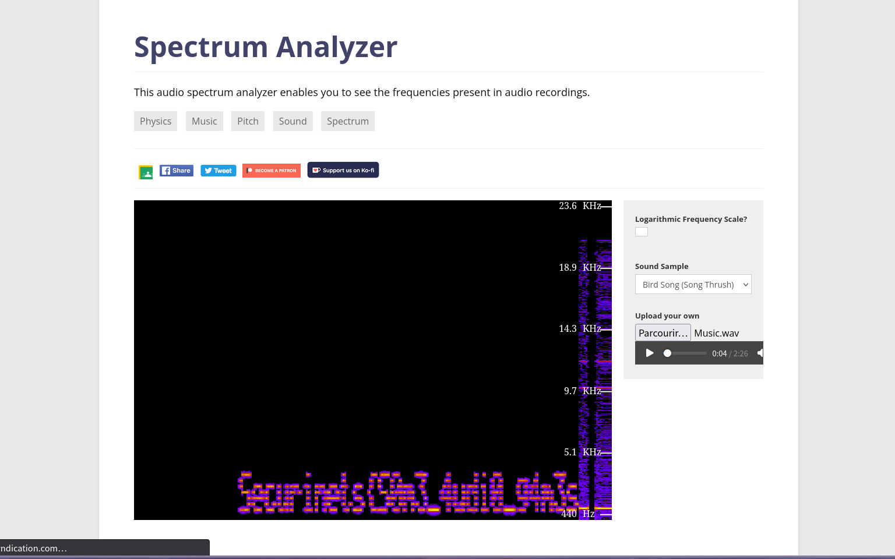

# CTF Task Write-Up

---

## Player’s Perspective

### Challenge Overview
You’ve been handed an audio file (`challenge.wav`) and told there’s a flag hidden inside. No hints beyond that.

---

### 1. Visual Steganography: Spectrogram Text
1. Open `challenge.wav` in a spectrogram viewer—e.g.  
   https://academo.org/demos/spectrum-analyzer/  
2. Observe that text has been etched into the frequency–time graph. It reads:  
```
Securinets{S0m3_4udi0_g4m3s
```
3. Notice the last part is cut off. The flag’s prefix is revealed, but the ending is missing.



---

### 2. Audio Steganography: Morse Code
1. Play the WAV. Beneath the tones you hear rapid beeps—Morse code!  
2. Go to a Morse audio decoder such as  
https://morsecode.world/international/decoder/audio-decoder-adaptive.html  
3. Decode the beeps. The output is:  
```
 W O W Y O U R H E R E T A K E T H E R E S T O F T H E F L A G U N D E R S C O R E H 4 V 3 U N D E R S C O R E F U N C L O S I N G C U R L Y B R A C K E T
```

---

### 3. Reconstructing the Flag
- **From spectrogram:**  
`Securinets{S0m3_4udi0_g4m3s`  
- **From Morse:**  
`…UNDERSCORE H4V3 UNDERSCORE FUN CLOSING CURLY BRACKET`

→ Combine to get the full flag:

```
Securinets{S0m3_4udi0_g4m3s_H4V3_FUN}
```


---

**Flag:** `Securinets{S0m3_4udi0_g4m3s_H4V3_FUN}`

---

## Author’s Perspective

### Objective
Blend two classic audio-steganography methods—spectrogram text and Morse code—to force solvers to use both visual and audio analysis tools.

---

### 1. Spectrogram Text Embedding
1. Start with the complete flag:  
```
Securinets{S0m3_4udi0_g4m3s_H4V3_FUN}
```
2. Use **AudioCheck Spectrotyper**  
(https://www.audiocheck.net/audiocheck_spectrotyper.php)  
to render that string as an audio spectrogram image.
3. Write the first part of the flag.
4. Convert back to audio—this gives the “musical” track containing the partial text.

---

### 2. Morse-Code Audio Embedding
1. Take the missing suffix:  
```
_H4V3_FUN}
```
2. Generate Morse code beeps via  
https://morsecode.world/international/trainer/generator.html  
3. Export as a standalone beep track.

---

### 3. Merging Tracks
1. In an audio editor (e.g. Audacity), layer the spectrogram track and the Morse-beep track.  
2. Adjust volumes so the musical tones mask the beeps, but the beeps remain decodable.  
3. Export the mixed result as `Music.wav`.

---

**Result:** A single audio file requiring both spectrogram analysis and Morse decoding to recover the full flag. Enjoy the double-layer puzzle!
